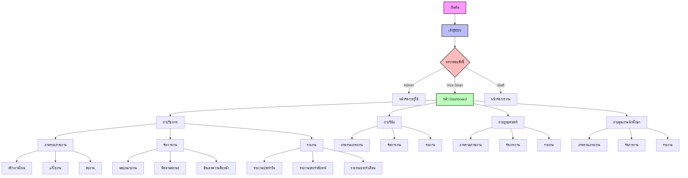
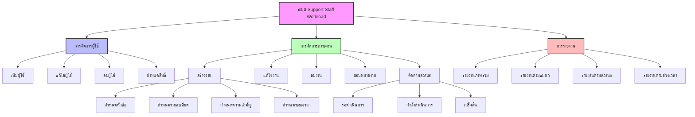
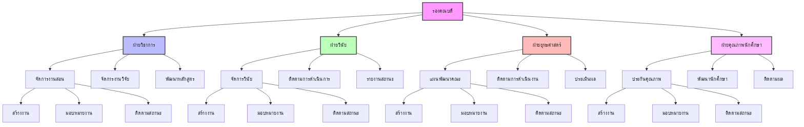

```mermaid
graph TD
    A[เริ่มต้น] --> B[เข้าสู่ระบบ]
    B --> C{ตรวจสอบสิทธิ์}
    C -->|Admin| D[หน้าจัดการผู้ใช้]
    C -->|Vice Dean| E[หน้า Dashboard]
    C -->|Staff| F[หน้าจัดการงาน]

    E --> G[ฝ่ายวิชาการ]
    E --> H[ฝ่ายวินัย]
    E --> I[ฝ่ายยุทธศาสตร์]
    E --> J[ฝ่ายคุณภาพนักศึกษา]

    G --> K[ภาพรวมภาระงาน]
    G --> L[จัดการงาน]
    G --> M[รายงาน]

    H --> N[ภาพรวมภาระงาน]
    H --> O[จัดการงาน]
    H --> P[รายงาน]

    I --> Q[ภาพรวมภาระงาน]
    I --> R[จัดการงาน]
    I --> S[รายงาน]

    J --> T[ภาพรวมภาระงาน]
    J --> U[จัดการงาน]
    J --> V[รายงาน]

    K --> W[สร้างงานใหม่]
    K --> X[แก้ไขงาน]
    K --> Y[ลบงาน]

    L --> Z[มอบหมายงาน]
    L --> AA[ติดตามสถานะ]
    L --> AB[อัพเดทความคืบหน้า]

    M --> AC[รายงานประจำวัน]
    M --> AD[รายงานประจำสัปดาห์]
    M --> AE[รายงานประจำเดือน]

    style A fill:#f9f,stroke:#333,stroke-width:2px
    style B fill:#bbf,stroke:#333,stroke-width:2px
    style C fill:#fbb,stroke:#333,stroke-width:2px
    style E fill:#bfb,stroke:#333,stroke-width:2px
```

```mermaid
graph TD
    A[ระบบ Support Staff Workload] --> B[การจัดการผู้ใช้]
    A --> C[การจัดการภาระงาน]
    A --> D[การรายงาน]

    B --> B1[เพิ่มผู้ใช้]
    B --> B2[แก้ไขผู้ใช้]
    B --> B3[ลบผู้ใช้]
    B --> B4[กำหนดสิทธิ์]

    C --> C1[สร้างงาน]
    C --> C2[แก้ไขงาน]
    C --> C3[ลบงาน]
    C --> C4[มอบหมายงาน]
    C --> C5[ติดตามสถานะ]

    D --> D1[รายงานภาพรวม]
    D --> D2[รายงานตามแผนก]
    D --> D3[รายงานตามสถานะ]
    D --> D4[รายงานตามช่วงเวลา]

    C1 --> E1[กำหนดหัวข้อ]
    C1 --> E2[กำหนดรายละเอียด]
    C1 --> E3[กำหนดความสำคัญ]
    C1 --> E4[กำหนดระยะเวลา]

    C5 --> F1[รอดำเนินการ]
    C5 --> F2[กำลังดำเนินการ]
    C5 --> F3[เสร็จสิ้น]

    style A fill:#f9f,stroke:#333,stroke-width:2px
    style B fill:#bbf,stroke:#333,stroke-width:2px
    style C fill:#bfb,stroke:#333,stroke-width:2px
    style D fill:#fbb,stroke:#333,stroke-width:2px
```

```mermaid
graph TD
    A[รองคณบดี] --> B[ฝ่ายวิชาการ]
    A --> C[ฝ่ายวินัย]
    A --> D[ฝ่ายยุทธศาสตร์]
    A --> E[ฝ่ายคุณภาพนักศึกษา]

    B --> B1[จัดการงานสอน]
    B --> B2[จัดการงานวิจัย]
    B --> B3[พัฒนาหลักสูตร]

    C --> C1[จัดการวินัย]
    C --> C2[ติดตามการดำเนินการ]
    C --> C3[รายงานสถานะ]

    D --> D1[แผนพัฒนาคณะ]
    D --> D2[ติดตามการดำเนินงาน]
    D --> D3[ประเมินผล]

    E --> E1[ประกันคุณภาพ]
    E --> E2[พัฒนานักศึกษา]
    E --> E3[ติดตามผล]

    B1 --> F1[สร้างงาน]
    B1 --> F2[มอบหมายงาน]
    B1 --> F3[ติดตามสถานะ]

    C1 --> G1[สร้างงาน]
    C1 --> G2[มอบหมายงาน]
    C1 --> G3[ติดตามสถานะ]

    D1 --> H1[สร้างงาน]
    D1 --> H2[มอบหมายงาน]
    D1 --> H3[ติดตามสถานะ]

    E1 --> I1[สร้างงาน]
    E1 --> I2[มอบหมายงาน]
    E1 --> I3[ติดตามสถานะ]

    style A fill:#f9f,stroke:#333,stroke-width:2px
    style B fill:#bbf,stroke:#333,stroke-width:2px
    style C fill:#bfb,stroke:#333,stroke-width:2px
    style D fill:#fbb,stroke:#333,stroke-width:2px
    style E fill:#fbf,stroke:#333,stroke-width:2px
``` 